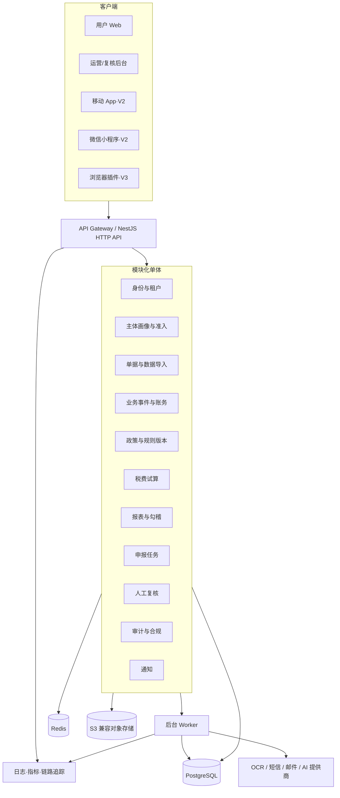
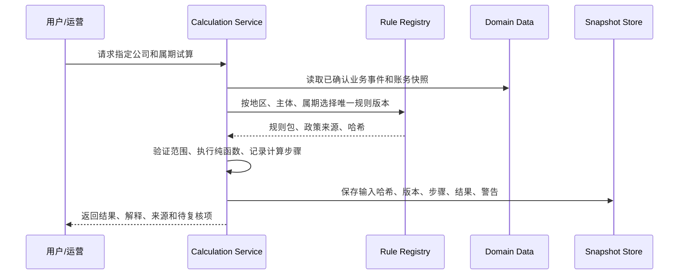

# 一人公司记账报税平台研发计划

> 文档版本：V1.1
> 编制日期：2026-10-07
> 对应产品文档：[《一人公司记账报税平台产品蓝图 V1.1》](./记账报税平台产品蓝图.html)
> 文档定位：架构基线、开发路线、质量门槛与 AI 编码总规范

---

## 修订记录

| 版本 | 日期 | 变更原因 | 影响范围 |
|---|---|---|---|
| V1.0 | 2026-10-07 | 基于产品蓝图 V1.1 建立首版研发基线 | 全部模块 |
| V1.1 | 2026-10-07 | 补充 V1 当前实现进度、验证结果、剩余路线及跨设备 AI 交接说明 | Sprint 0–4、工程运行与交接 |

---

## 0. 文档用法

本文档用于统一产品、财税、设计、开发、测试、运维和 AI 编码代理的工作方式。后续任何代码任务应同时引用：

1. 产品蓝图中对应的业务章节。
2. 本文档对应的技术模块、数据契约和验收标准。
3. 仓库内相关 ADR、OpenAPI、JSON Schema 和测试样本。

如果产品蓝图、本文档和现有代码冲突，不允许 AI 自行选择。必须先新建或更新 ADR，说明变更原因、迁移方案、风险和回滚方案，再改代码。

---

## 1. 研发目标与范围

### 1.1 首期交付目标

用 14–16 周完成一个可受控试点的 Web 产品，支持以下最小闭环：

1. 江苏省一人有限责任公司建档与适用性筛查。
2. 导入银行 CSV、发票及手工录入业务事件。
3. 生成凭证草稿、往来核销、总账、利润表和资产负债表。
4. 按锁定的规则版本生成增值税、附加税费、企业所得税试算草稿。
5. 执行完整性与勾稽检查，生成可追溯的差异清单。
6. 由合作专业人员在运营后台复核。
7. 生成申报任务卡和数据包，用户到官方平台自主提交。
8. 上传申报回执和完税凭证，关闭任务并冻结当期计算快照。

### 1.2 V1 明确不做

- 不代用户登录或提交电子税务局。
- 不保存税务密码、短信验证码或资金划转凭证。
- 不支持一般纳税人、个体户、个人独资、核定征收、建筑与不动产、差额征税、进出口和复杂薪酬。
- 不在 V1 开发原生 App、小程序和浏览器插件。
- 不引入微服务、Kubernetes、分布式事务或自建机器学习平台。
- 不让大语言模型直接决定金额、税率、分录或申报数字。

### 1.3 核心研发原则

1. **可追溯优先于自动化**：每个数字必须追溯到事实、规则版本和确认人。
2. **模块化单体优先于微服务**：保留清晰边界，但避免早期分布式复杂度。
3. **契约优先**：前后端、规则和任务通过 OpenAPI、JSON Schema 和事件 Schema 协作。
4. **确定性计算优先**：财税结果由纯函数和版本化规则得出；AI 只生成建议。
5. **默认拒绝不明确场景**：超出范围时转人工，不做“最可能”的报税结论。
6. **租户隔离和审计内建**：不把安全、审计、隐私留到上线前补做。
7. **可替换不等于抽象泛滥**：仅对外部依赖、变化快的政策和跨端契约设置稳定接口。

---

## 2. 总体技术架构

### 2.1 交付形态

| 交付端 | 用户 | 技术路线 | 开发阶段 |
|---|---|---|---|
| 用户 Web | 一人公司老板 | Next.js + React + TypeScript，响应式 Web | V1 主端 |
| 运营/复核后台 | 运营、会计、税务审核人员 | 同一 Next.js 应用的独立路由区与权限域 | V1 必须 |
| 营销官网 | 潜在客户 | Next.js 静态/服务端渲染 | V1 简版 |
| 移动 App | 高频拍票、提醒用户 | Expo / React Native + TypeScript | V2，契约稳定后 |
| 微信小程序 | 轻量提醒、拍票、任务查看 | Taro + React + TypeScript | V2，不承载复杂申报 |
| 浏览器插件 | 申报辅助 | Manifest V3 + React + TypeScript | V3，先完成法务与官方授权论证 |
| 后端 API | 全部客户端 | NestJS + Fastify + TypeScript | V1 |
| 后台任务 | 导入、OCR、报表、通知 | Redis + BullMQ Worker | V1 |

### 2.2 系统全景



### 2.3 为什么首期使用模块化单体

- 业务模型和财税规则尚未稳定，跨模块调整频繁。
- 账务入账、结账、试算和冻结需要强事务一致性。
- 早期团队小，微服务会放大部署、观测、事务、数据一致性和本地开发成本。
- 通过“模块私有表 + 公开应用服务 + 域事件”维持边界，待出现独立扩展需求再拆服务。

只有同时满足以下条件才允许拆微服务：边界已稳定、独立扩容有明确数据、拥有独立运维责任人、事件契约已版本化、拆分收益大于一致性成本。

---

## 3. 技术栈与版本策略

### 3.1 推荐技术栈

| 领域 | 选型 | 说明 |
|---|---|---|
| 语言 | TypeScript | 前后端统一，降低 AI 生成代码的上下文切换和类型偏差 |
| Monorepo | pnpm workspace + Turborepo | 统一契约、域类型、UI 组件、配置与构建缓存 |
| Web | Next.js App Router + React | 用户端、后台和官网使用同一技术栈；不在 Server Action 内实现核心业务 |
| UI | Tailwind CSS + 自有 Design Tokens + Radix 类无样式基础组件 | 保留主题、可访问性和跨端设计系统可演进性 |
| 表单/校验 | React Hook Form + Zod | 客户端体验校验；服务端仍重新校验 |
| 数据请求 | TanStack Query + 由 OpenAPI 生成的 SDK | 不手写重复 fetch 和请求类型 |
| API | NestJS + Fastify + OpenAPI | 模块化、依赖注入、鉴权、校验、拦截器和合同生成 |
| ORM | Prisma 或 Drizzle，启动期用 ADR 二选一 | 未完成 ADR 前不同时引入两套 ORM |
| 数据库 | PostgreSQL | 事务、精确数值、JSONB、索引、约束和审计查询 |
| 队列/缓存 | Redis + BullMQ | 导入、OCR、重算、报表生成、通知和失败重试 |
| 文件 | S3 兼容对象存储 | 原始文件与衍生文件分开、版本化、生命周期和签名 URL |
| 测试 | Vitest + Testcontainers + Playwright | 纯函数、数据库集成和端到端测试 |
| 观测 | OpenTelemetry + 结构化日志 + Sentry 类错误平台 | trace_id 贯穿 HTTP、任务和计算执行 |
| 基础设施 | Docker + IaC | 开发/测试/预发/生产一致；云厂商通过适配层隔离 |

### 3.2 版本管理

- Node.js 使用项目启动时的 Active LTS，通过 `.tool-versions` 或 Volta 锁定精确版本。
- 框架和数据库不在文档中写死“永远最新”；创建项目时选定稳定版本，在 lockfile 中锁定。
- 每月合并补丁和小版本；每季评估次版本；主版本必须有 ADR、迁移清单和回归测试。
- 不允许 AI 在单个功能 PR 中顺手升级主要依赖。
- 数据库升级使用云厂商或 PostgreSQL 官方支持的稳定大版本，至少提前一个环境完成恢复演练。

---

## 4. 各端架构

### 4.1 用户 Web 端

#### 页面域

- `/onboarding`：建档、税种认定核对、适用性判定。
- `/dashboard`：资金、应收、利润、预计税额、待办。
- `/events`：履约、开票、收付款、计提和调整事件。
- `/imports`：银行 CSV、发票、单据导入与差异处理。
- `/reconciliation`：银行、发票、往来和账务勾对。
- `/ledger`：凭证草稿、明细账和期间结账。
- `/reports`：利润表、资产负债表和差异说明。
- `/tax`：试算结果、规则来源、计算链和风险项。
- `/filings`：申报任务卡、官方操作引导、回执上传。
- `/documents`：档案检索、预览、导出和保管期限。
- `/settings`：公司、账户、人员、授权、安全与数据导出。

#### 前端分层

```text
route/page
  ↓ 只负责路由、权限和数据预加载
feature
  ↓ 完成一个用户任务，如“导入银行流水”
entity-view
  ↓ 可复用的业务展示，如凭证、发票、任务卡
ui
  ↓ 无业务知识的通用组件
sdk/schema
  ↓ 由 OpenAPI/Schema 生成的类型与客户端
```

禁止事项：

- 不在 React 组件中计算税额或生成分录。
- 不在页面内硬编码税率、阈值、征期和申报栏次。
- 不以前端隐藏替代后端鉴权。
- 不在多个页面复制 API 类型、金额格式化和错误映射逻辑。

### 4.2 运营与专业复核后台

后台与用户端可共用仓库、设计 Token 和 SDK，但必须使用独立路由区、独立权限和独立审计标记。

核心功能：

- 试点客户和账套状态。
- 黄/红风险工单队列。
- 原始证据、系统草稿、差异和规则链并排展示。
- 复核、驳回、补充资料、调整建议和回写理由。
- 规则草案、测试结果、双人审批和灰度发布。
- 受影响账套查询、错误通知和更正追踪。
- 审计日志、敏感数据访问日志和数据导出审批。

权限至少包含：`support_readonly`、`accounting_reviewer`、`tax_reviewer`、`rule_editor`、`rule_approver`、`security_auditor`、`platform_admin`。规则编辑人不得审批自己的规则。

### 4.3 移动 App（V2）

移动端不复制 Web 的全部功能，只聚焦：

- 拍照、文件上传和离线草稿。
- 快速记录收款、支出、开票、垫付。
- 待确认建议和补资料任务。
- 征期和风险提醒。
- 读取家底看板和申报状态。

离线数据只保存未提交草稿和短期缓存，使用平台安全存储；同步必须带 `clientMutationId`、版本号和幂等键。冲突时不做静默覆盖。

### 4.4 微信小程序（V2）

- 与 App 共用 OpenAPI SDK、域类型、设计 Token 和基础校验 Schema。
- 小程序仅做轻量录入、上传、提醒和状态查看。
- 复杂对账、报表审阅和申报数据核对引导用户打开 Web。
- 微信用户身份与平台账号解耦，通过 `IdentityLink` 映射，不把 OpenID 当业务主键。

### 4.5 浏览器插件（V3）

插件默认只读：

- 识别当前官方页面版本。
- 在本地展示对应任务卡和待核对数字。
- 由用户手工确认后标记步骤完成。

未完成法务、官方平台条款、安全威胁模型和页面版本监控前，禁止自动填表、注入凭证或代点提交。

---

## 5. 后端模块和依赖边界

### 5.1 模块划分

| 模块 | 职责 | 拥有的主要数据 |
|---|---|---|
| Identity & Access | 登录、MFA、会话、角色、授权 | User、Identity、Session、Role、Permission |
| Tenant & Company | 租户、公司、成员、账套 | Tenant、Company、CompanyMember、LedgerBook |
| Profile & Scope | 主体画像、税种认定、适用性筛查 | Profile、TaxRegistration、ScopeEvaluation |
| Counterparty | 客户、供应商、股东等往来方 | Counterparty、Contact、CounterpartyRule |
| Document | 上传、查杀、存储、OCR、档案 | Document、DocumentVersion、OcrRun、ArchiveManifest |
| Import | 导入批次、解析、映射、去重、失败重试 | ImportBatch、ImportRow、ImportMapping |
| Business Event | 履约、开票、收付款、计提、调整 | BusinessEvent、EventLink、EvidenceLink |
| Invoice | 蓝/红字发票、价税、状态、核销 | Invoice、InvoiceLine、InvoiceSettlement |
| Banking | 资金账户、银行流水、余额、对账 | FinancialAccount、BankStatementLine、Reconciliation |
| Accounting | 科目、凭证草稿、分录、总账、结账 | ChartOfAccount、Voucher、Entry、AccountingPeriod |
| Policy & Rule | 政策来源、规则、版本、发布和回滚 | PolicySource、RuleSet、RuleVersion、RuleRelease |
| Calculation | 计算执行、输入快照、计算链、结果快照 | CalculationRun、CalculationStep、CalculationResult |
| Tax | 增值税、附加、企业所得税、个税草稿 | TaxEvent、TaxEstimate、TaxAdjustment |
| Reporting | 科目余额、两表、勾稽和差异 | Balance、ReportSnapshot、CheckRun、CheckFailure |
| Filing | 征期、任务、申报数据包、回执 | FilingCalendar、FilingTask、FilingPackage、FilingReceipt |
| Review | 复核工单、意见、驳回、签署 | ReviewCase、ReviewDecision、Workpaper |
| Notification | 站内信、短信、邮件、模板和抑制策略 | Notification、Template、DeliveryAttempt |
| Audit & Consent | 不可抵赖操作记录、敏感数据访问、授权 | AuditEvent、AccessLog、ConsentGrant |
| Billing | 套餐、订阅、订单、发票索取 | Plan、Subscription、Order（V1 可先人工开通） |

### 5.2 依赖规则

- 每个模块包含 `domain`、`application`、`infrastructure`、`presentation` 四层。
- `domain` 不得引用 NestJS、ORM、Redis、HTTP SDK 或云厂商包。
- `application` 通过端口接口使用仓储、队列、时钟、ID 和外部服务。
- `infrastructure` 实现端口，不包含业务决策。
- `presentation` 只负责 HTTP/任务入口、鉴权、校验、DTO 映射和错误转换。
- 模块不得直接读写其他模块的表；通过公开应用服务或域事件交互。
- 同步调用用于需要即时一致的业务；异步事件用于 OCR、报表、通知、影响分析等可重试工作。

### 5.3 关键用例的事务边界

| 用例 | 必须在单一数据库事务内完成 |
|---|---|
| 确认业务事件 | 事件版本、用户确认、凭证草稿关联、审计事件、Outbox 事件 |
| 确认凭证 | 凭证状态、分录不可变版本、期间检查、审计事件 |
| 结账 | 期间状态、输入哈希、余额快照、勾稽结果、Outbox 事件 |
| 发布规则 | 不可变规则版本、审批人、测试证据、生效区间、发布事件 |
| 冻结申报包 | 输入快照、规则版本、计算结果、表单版本、哈希、复核决定 |

---

## 6. 数据架构

### 6.1 数据分类

1. **原始证据**：原文件、银行原始行、OCR 原文、导入批次。只增不覆盖。
2. **业务事实**：履约、开票、收付款、计提和调整事件。修改生成新版本或更正事件。
3. **派生账务**：凭证草稿、分录、余额和报表。未结账期间可重建。
4. **冻结快照**：已结账报表、已复核计算、申报数据包。不得就地修改。
5. **审计与授权**：操作、访问、审批、同意和撤回。具有独立保管和查询策略。

### 6.2 通用字段约定

所有租户业务表至少包含：

```text
id                  UUIDv7 / ULID
tenant_id           租户边界
company_id          公司边界（如适用）
version             乐观锁版本
created_at          timestamptz
created_by          操作主体
updated_at          timestamptz
updated_by          操作主体
```

数值和时间规则：

- 金额使用 `numeric(20, 2)` 或值对象 `Money`，禁止 JavaScript `number` 直接参与财务计算。
- 税率、比例使用 `numeric(12, 8)` 或十进制库，不使用浮点数。
- 金额舍入方法必须是规则参数，不在调用处散落 `round(2)`。
- 业务日期使用 `date`；事件时间使用 UTC `timestamptz`；界面按 `Asia/Shanghai` 显示。
- 税期使用明确的 `period_start` / `period_end`，不仅保存“2026Q3”字符串。
- 枚举值通过代码和数据库检查约束双重保护。

### 6.3 租户隔离

- 每个请求先解析 `tenant_id`，应用服务和仓储均要求租户上下文。
- 所有主键/唯一索引根据业务增加 `tenant_id` 或 `company_id`，防止跨租户冲突和误查。
- 可用 PostgreSQL Row Level Security 作为第二道防线，但不代替应用鉴权。
- 后台跨租户访问必须有具体工单、理由、有效期和审计日志。
- 生产数据不得直接复制到开发/测试环境；需要时使用不可逆脱敏样本。

### 6.4 迁移策略

- 每个 Schema 变更包含前向迁移、数据回填脚本、兼容窗口和回滚方案。
- 生产使用 expand → migrate → switch → contract，禁止一步删列或改语义。
- 数据库迁移文件合并后不修改历史；错误使用新迁移修复。
- 大表回填使用可暂停、可重试、可观测的批处理任务。

---

## 7. 规则和计算引擎

### 7.1 设计原则

- 规则是不可变、可审批、可测试、可发布、可回滚的数据产品。
- 计算引擎是纯函数集：相同输入快照 + 相同规则版本 = 字节级稳定结果。
- 规则不使用 `eval`、动态 JavaScript 或允许任意代码执行的表达式。
- 核心税务公式用类型化代码实现；阈值、税率、适用范围、文案和栏次映射使用版本化配置。
- 任何未匹配、多规则冲突或输入缺失都返回结构化 `DecisionRequired`，不返回默认税额。

### 7.2 规则包结构

```text
rules/
  vat/
    cn-js-small-scale-modern-service/
      manifest.json
      parameters.schema.json
      mapping.json
      explanation.zh-CN.md
      fixtures/
  surcharges/
  corporate-income-tax/
  stamp-duty/
```

`manifest.json` 至少包含：

```json
{
  "ruleSetId": "vat.cn-js.small-scale-modern-service",
  "version": "2026.10.01-1",
  "jurisdiction": ["CN", "CN-JS"],
  "effectiveFrom": "2026-10-01",
  "effectiveTo": "2027-12-31",
  "appliesWhen": {
    "vatTaxpayerType": "small_scale",
    "filingFrequency": "quarterly",
    "baseLevyRate": "0.03"
  },
  "policySources": ["policy-source-id"],
  "calculationImplementation": "vat-small-scale-v1",
  "fixtureSet": "vat-small-scale-2026q4",
  "status": "draft"
}
```

### 7.3 计算执行流程



### 7.4 规则发布流程

`draft → technical_reviewed → tax_reviewed → tested → approved → scheduled → active → superseded/withdrawn`

- 编辑人和审批人必须不同。
- 发布前必须运行所有单元样本、黄金账套和新旧版本差异报告。
- 影响已开放期间时，只对未冻结计算重算。
- 已申报期间只生成“潜在差异”和更正工单，不改写原快照。

---

## 8. API 和契约

### 8.1 协议约定

- 业务 API 使用 REST + JSON，前缀 `/api/v1`。
- OpenAPI 文档由后端源码生成并在 CI 校验差异。
- Web、App、小程序的 SDK 由 OpenAPI 生成，不各自维护请求类型。
- 所有写请求支持 `Idempotency-Key`；客户端离线同步同时发送 `clientMutationId`。
- 更新受版本保护的实体时必须传 `version` 或 `If-Match`；冲突返回 `409` 和可理解差异。
- 列表使用游标分页；导出使用异步任务，不在 HTTP 请求中长时间持有连接。
- 日期用 ISO 8601，金额和税率在 JSON 中使用字符串，避免浮点精度丢失。

### 8.2 统一错误格式

```json
{
  "type": "https://errors.example.com/accounting/period-locked",
  "title": "当前会计期间已锁定",
  "status": 409,
  "code": "ACCOUNTING_PERIOD_LOCKED",
  "detail": "请发起反结账申请或在当期录入更正事件。",
  "traceId": "...",
  "fieldErrors": []
}
```

错误码是稳定 API 契约，不使用中文错误文案作为程序分支条件。

### 8.3 首期 API 域

```text
/auth
/tenants
/companies
/profiles
/tax-registrations
/counterparties
/documents
/imports
/business-events
/invoices
/financial-accounts
/bank-statement-lines
/reconciliations
/vouchers
/accounting-periods
/rules                 专业样本与影子分析
/rules/governance      政策来源、规则草稿与双重复核（运营/专业权限）
/calculation-runs
/tax-estimates
/reports
/checks
/filing-tasks
/filing-packages
/review-cases
/audit-events
/consents
/exports
```

### 8.4 事件契约

域事件包含：

```text
event_id
event_type
event_version
occurred_at
tenant_id
company_id
actor
correlation_id
causation_id
payload
```

事件 Schema 存放在 `packages/contracts/events`，发布后不删除已有字段或改变含义。不兼容变更增加 `event_version` 并保留旧消费者迁移窗口。

---

## 9. 异步任务、导入与外部集成

### 9.1 异步任务模型

用于：

- CSV/PDF/OFD 解析、病毒扫描和 OCR。
- 重算凭证草稿、科目余额、报表和勾稽检查。
- 生成导出包和档案清单。
- 短信、邮件、站内信和征期提醒。
- 规则发布的影响分析。

每个任务必须定义：幂等键、最大尝试次数、指数退避、可重试/不可重试错误、死信队列、超时、进度、所有者和告警阈值。

### 9.2 Outbox 模式

业务状态和待发布事件在同一 PostgreSQL 事务中写入。Outbox Publisher 使用行锁和批次处理发布到队列，消费者使用 `event_id` 去重。不使用“先写库再发消息”的双写方式。

### 9.3 导入流水线

`uploaded → scanning → parsing → mapped → validation_failed/ready → user_confirmed → committed`

- 原始文件先计算 SHA-256 和文件大小，使用幂等键防止重复导入。
- 解析结果与原始行/页坐标关联，便于用户和复核人回看。
- OCR 输出不覆盖原文，每个字段保留置信度、引擎版本和人工修改。
- 导入行通过验证并经用户确认后才转为业务事实。

### 9.4 外部服务适配层

所有 OCR、AI、短信、邮件、对象存储和身份服务均通过 Port/Adapter 接入：

```text
OcrProvider
ClassificationProvider
NotificationProvider
ObjectStorageProvider
IdentityProvider
Clock
IdGenerator
```

业务代码不得直接引用云厂商 SDK。适配层必须屏蔽厂商错误、支持超时和断路、不在日志中打印原始敏感数据。

---

## 10. AI 能力边界

### 10.1 允许 AI 做的事

- OCR 结果后的商户、摘要和业务类型候选。
- 用大白话解释已由确定性引擎产生的计算链。
- 将用户自然语言转为待确认的结构化草稿。
- 根据知识库检索相关政策来源和 SOP，但必须显示来源与验证日期。
- 为人工复核工单生成问题摘要，不替代复核决策。

### 10.2 禁止 AI 做的事

- 自行编造政策文号、税率、阈值或征期。
- 直接修改金额、日期、对方、发票号码等事实字段。
- 绕过用户确认生成正式凭证。
- 直接产生申报数字或改变计算引擎结果。
- 将用户数据用于模型训练，除非完成单独同意、数据最小化、供应商条款与安全评估。

### 10.3 AI 输出契约

AI 必须输出受 JSON Schema 约束的草稿，包含：

- `suggestion`
- `confidence`
- `evidenceRefs`
- `model`
- `promptVersion`
- `createdAt`
- `requiresConfirmation: true`
- `warnings`

低置信度、证据冲突或 Schema 校验失败直接进人工队列。

---

## 11. 安全、隐私与档案

### 11.1 安全基线

- 全站 HTTPS；服务间 TLS；敏感数据列级或字段级加密。
- 密钥由 KMS/专用密钥管理服务托管，密钥和数据分离。
- 密钥、数据库凭证、供应商 Token 只放密钥管理系统，不放仓库或前端环境变量。
- 登录、导出、查看银行流水、规则发布、反结账等高风险操作支持二次验证。
- 文件上传限制 MIME、扩展名、大小和页数，进行病毒扫描，使用私有桶和短效签名 URL。
- 所有日志使用脱敏器，禁止记录密码、Token、完整银行账号、身份证号和原始文件内容。
- 依赖、容器、密钥和 SAST 扫描纳入 CI；高危漏洞阻断发布。

### 11.2 隐私与授权

- 对身份、银行账户、流水、薪酬等敏感信息记录处理目的、必要性、保管期、接收方和单独同意。
- 同意文本版本化；撤回后停止新处理，但区分法定档案保管与用户可删除数据。
- 第三方 OCR、AI、短信与对象存储需要供应商清单、数据处理协议、存储地域和删除机制。
- 不默认将生产数据发往境外服务；需要时先完成法务和安全评估。

### 11.3 电子档案

- 保存原始文件、文件哈希、元数据、来源、审签、版本、关联账务对象和保管类型。
- 档案不允许就地替换；新文件作为新版本并保留关系。
- 生成年度导出包：原始凭证、记账凭证、账簿、报表、申报表、回执、索引清单和校验文件。
- 导出包必须能在不依赖本平台的情况下读取。
- 保管期和销毁不使用统一 TTL；按档案类型配置，到期先鉴定后销毁。

### 11.4 备份与灾备

- PostgreSQL 持续归档/WAL + 每日全量备份；对象存储开启版本与跨故障域备份。
- 受控试点的目标：RPO ≤ 15 分钟，RTO ≤ 4 小时。
- 每月自动验证备份可读，每季在隔离环境做一次全链路恢复演练。
- 恢复成功的定义不是数据库启动，而是抽样账套可登录、可查账、可验证哈希、可重现已申报计算。

### 11.5 中国大陆上线合规检查

- 公网服务上线前确认 ICP 备案、公安联网备案等要求及办理主体；未完成前仅使用受控测试环境。
- 结合系统处理的数据类型、用户规模和部署形态，由专业机构判断网络安全等级保护的定级、备案与测评义务。
- 按《个人信息保护法》《数据安全法》《网络安全法》等适用要求完成数据分类分级、最小必要、授权同意、处理者管理和安全事件预案；具体文本与义务由律师复核。
- 财税服务边界、代理记账/涉税专业服务资质、电子会计档案、发票和申报资料保管要求由法务及财税负责人确认，不由研发或 AI 自行解释。
- 短信、邮件、云资源、OCR 与 AI 供应商须完成实名主体、合同、数据处理条款、存储地域和分包商审查。
- 如未来发生个人信息出境或调用境外模型，不得仅靠配置开关上线，必须先完成适用性评估和审批记录。

---

## 12. 非功能目标

### 12.1 性能和容量（受控试点）

| 指标 | 目标 |
|---|---|
| 普通 API P95 | 小于 500 ms（不含文件上传和外部服务） |
| 家底看板 P95 | 小于 1 s，使用已计算读模型 |
| 同步试算 | 10,000 个业务事件在 3 s 内；超出转异步任务 |
| CSV 导入 | 单批 20,000 行，可查进度、可取消、可重试 |
| 文件上传 | V1 单文件默认最大 20 MB，通过配置调整 |
| 可用性 | 试点期月度 99.5%；正式放量后目标 99.9% |
| 数据一致性 | 正式凭证借贷不平衡数量永远为 0 |
| 可重现性 | 已申报计算抽样复算一致率 100% |

### 12.2 观测

每个 HTTP 请求、后台任务、导入批次和计算执行共享 `trace_id`。

关键指标：

- API 延迟、错误率、数据库慢查询和连接池。
- 队列长度、最旧任务等待时间、重试率和死信数。
- 导入成功率、OCR 字段修改率、勾对完整率。
- 规则冲突数、计算失败数、新旧版本差异金额。
- 黄/红工单数、复核时长和逾期数。
- 敏感数据访问量和异常跨租户拒绝。

告警必须有所有者、优先级、处置手册和升级路径，不只发一条无人处理的消息。

---

## 13. Monorepo 目录基线

```text
ledgerly/
  apps/
    web/                    # 用户 Web、运营后台、官网
    api/                    # NestJS HTTP API
    worker/                 # BullMQ workers
    mobile/                 # V2 Expo，未开发前不创建空工程
    mini-program/           # V2 Taro
    browser-extension/      # V3
  packages/
    contracts/
      openapi/
      events/
      json-schema/
    domain/
      money/
      accounting/
      tax/
      filing/
    calculation-engine/
    rules/
    api-client/
    ui-web/
    design-tokens/
    observability/
    config-eslint/
    config-typescript/
    test-fixtures/
  infrastructure/
    docker/
    terraform-or-equivalent/
    monitoring/
  docs/
    product/
    architecture/
      adr/
      diagrams/
    api/
    rules/
    runbooks/
    security/
  tools/
    codegen/
    migrations/
    data-anonymization/
  .github-or-ci/
  pnpm-workspace.yaml
  turbo.json
  package.json
```

约束：

- `packages/domain` 不依赖 `apps/*`。
- `packages/rules` 可依赖 `calculation-engine` 公开类型，不反向依赖应用。
- `apps/web` 不直接依赖后端 ORM 类型。
- 共享包不得成为“杂物间”；新增共享包需说明所有者、公开 API 和版本责任。

---

## 14. 代码规范与 AI 编码约束

### 14.1 通用约束

- TypeScript 开启 `strict`、`noUncheckedIndexedAccess`、`exactOptionalPropertyTypes`。
- 禁止 `any`；外部输入使用 `unknown` 并通过 Schema 缩小类型。
- 域内使用值对象：`Money`、`Rate`、`TaxPeriod`、`CompanyId`、`RuleVersionId`。
- 禁止在 Controller、React 组件、ORM Hook 或队列 Processor 中直接编写核心业务规则。
- 异常使用类型化域错误；不使用字符串匹配判断错误类型。
- 新增公开 API、事件、数据库表或规则字段时必须同步更新契约和文档。
- 不提交被注释掉的旧代码、无所有者 TODO 或临时跳过测试。

### 14.2 AI 任务执行协议

每次让 AI 写代码时，任务描述必须包含：

```text
目标：用一句话说明用户或系统结果
范围：允许修改的模块和文件
非目标：本次不做什么
业务依据：产品蓝图和规则条目
技术依据：ADR、OpenAPI、Schema、相关模块
输入/输出：明确数据契约
边界条件：正常、空值、重复、冲突、跨期、已锁定
权限与审计：谁能操作，留什么记录
验收标准：可自动测试的 Given/When/Then
必跑测试：单元、集成、契约或 E2E
```

AI 执行任务时必须：

1. 先阅读对应模块 README、ADR 和现有测试。
2. 先汇报会修改的契约和风险，再实现。
3. 尽量完成一个端到端竖切，不先生成大量未使用抽象。
4. 每次只解决一个可验收目标，不顺手重构无关模块。
5. 税务公式必须先写失败测试和黄金样本，再写实现。
6. 不伪造官方来源；缺少口径时返回待确认问题。
7. 完成后报告变更文件、迁移、测试、未解决风险和回滚方式。

### 14.3 ADR 触发条件

以下变更必须新建 ADR：

- 更换框架、ORM、数据库、队列、身份或云厂商核心服务。
- 新增微服务、独立数据库或跨区域部署。
- 改变金额精度、计算舍入、时区、主键和租户隔离方式。
- 允许系统代用户访问官方税务系统或保存新类型敏感凭证。
- 修改规则发布、已申报快照、电子档案或审计的不可变原则。

---

## 15. 测试策略

### 15.1 测试分层

| 层级 | 主要对象 | 要求 |
|---|---|---|
| 单元测试 | Money、Rate、分录、税务纯函数、状态机 | 快速、无外部依赖；所有边界和舍入必测 |
| 属性测试 | 借贷平衡、幂等、可重现、金额不丢失 | 对随机输入验证不变量 |
| 集成测试 | PostgreSQL、Redis、仓储、Outbox、RLS | 使用 Testcontainers 和真实迁移 |
| 契约测试 | OpenAPI、事件 Schema、外部适配器 | 阻断破坏性变更 |
| 黄金测试 | 税额、报表、申报包 | 由专业人员签审输入和期望结果 |
| E2E | 建档→导入→对账→结账→试算→复核→回执 | 覆盖最小闭环和主要失败分支 |
| 安全测试 | 跨租户、越权、文件、注入、限流、日志泄露 | 高风险用例进 CI 和发布前检查 |
| 恢复测试 | 数据库、对象、规则和密钥 | 验证可读、哈希和计算可重现 |

### 15.2 必备黄金样本

- 无业务零申报。
- 季销售额低于、等于和高于免税阈值。
- 普票、专票、未开票收入、红字发票和作废。
- 季中成立、季初/季末资产与从业人数。
- 城建税 7% / 5% / 1% 所在地。
- 投资款、个人垫付、垫付归还、股东借款和分红。
- 先履约后开票、先开票后履约、分次收款和合并收款。
- 重复导入、跨期、反结账、更正凭证和更正申报。
- 新规则对未结账期间重算，不改写已申报快照。

### 15.3 覆盖率政策

不以全局行覆盖率作为唯一目标。必须满足：

- 规则和计算引擎的分支覆盖率 100%。
- 金额、舍入、状态机、锁定和幂等主要不变量全部有测试。
- 每个生产错误先增加回归测试，再修复。

---

## 16. CI/CD 与环境

### 16.1 环境

| 环境 | 用途 | 数据 |
|---|---|---|
| local | 本地开发 | 合成数据，Docker 依赖 |
| test | CI 集成测试 | 每次创建，用后销毁 |
| preview | PR 可视验收 | 合成/脱敏数据，独立租户 |
| staging | 发布候选、数据迁移和恢复演练 | 合成与严格脱敏数据 |
| production | 受控试点/正式服务 | 真实数据，最小权限 |

### 16.2 PR 检查

1. 格式、Lint、TypeScript 类型检查。
2. 单元和属性测试。
3. PostgreSQL/Redis 集成测试。
4. OpenAPI、事件 Schema 和数据库迁移检查。
5. 依赖、SAST、密钥、容器漏洞扫描。
6. 受影响的黄金样本和 E2E。
7. 构建所有受影响应用和生成预览环境。

### 16.3 发布

- `main` 始终可部署；短分支、小 PR、至少一人审查，规则与安全变更需要指定审批人。
- 应用部署使用滚动或蓝绿发布；数据库使用向前兼容迁移。
- 高风险功能使用服务端 Feature Flag，可按租户、公司、用户和百分比灰度。
- 税务规则发布与应用发布分离，但都要审批、可观测和可回滚。
- 生产发布后执行烟雾测试和关键计算抽样；异常自动暂停灰度。

---

## 17. 开发路线与节奏

以 2 周为一个 Sprint。下列估算基于 3–4 名工程人员（至少 1 名资深全栈/架构负责人）、1 名产品/设计、1 名兼职财税负责人和 QA 能力。如主要依赖单人 + AI，时间应扩大 1.5–2 倍，不降低质量门槛。

### Sprint 0（第 1–2 周）：契约与基础

**交付：**

- 锁定 ICP、业务词汇表和不适用清单。
- ADR-001 架构、ADR-002 ORM、ADR-003 身份服务、ADR-004 云与存储。
- Monorepo、CI、基础配置、本地 Docker、预览环境。
- 身份、租户、公司和审计的最小竖切。
- OpenAPI 产生 SDK 的第一条通路。
- Money、Rate、Date/Period 值对象和测试。

**退出标准：**

- 新开发者可在 30 分钟内启动 Web、API、Worker、PostgreSQL 和 Redis。
- 创建租户/公司的 E2E 通过；跨租户访问被拒绝并有审计记录。

### Sprint 1（第 3–4 周）：建档和准入

**交付：**

- 公司建档问卷、税种认定录入、地区和业务画像。
- 适用性决策表、绿/黄/红分流和理由。
- 资金账户、期初余额、往来单位、会计期间。
- 运营后台查看账套与准入结果。

**退出标准：**一个新公司能被确定地判断为可试点或拒绝；所有决策带规则 ID 和解释。

### Sprint 2（第 5–6 周）：单据、导入和事实层

**交付：**

- 私有对象存储上传、哈希、病毒扫描接口、文件版本。
- 银行 CSV 导入批次、列映射、解析错误和重复检测。
- 业务事件创建、版本、证据关联和用户确认。
- 发票基础模型，OCR 先用人工录入/模拟适配器。

**退出标准：**同一文件和同一银行行重复导入不产生重复事实；原始行可追溯。

### Sprint 3（第 7–8 周）：账务核心

**交付：**

- 小企业会计准则的 V1 科目模板。
- 业务事件→凭证草稿的确定性映射。
- 凭证确认、冲销、借贷平衡、明细账与科目余额。
- 发票与收款、垫付与归还的 N:N 核销。
- 会计期间锁定、反结账申请和审计。

**退出标准：**所有正式凭证借贷平衡；锁定期间不得被普通写请求修改。

### Sprint 4（第 9–10 周）：规则、税费和报表

**交付：**

- 政策来源、规则包、版本、双人审批和发布流程。
- 增值税、附加税费和企业所得税 V1 试算。
- 计算输入快照、规则哈希、计算步骤和解释。
- 利润表、资产负债表、银行和往来勾稽。
- 第一批税务专家签审黄金样本。

**退出标准：**黄金样本关键税额错误为 0；任一结果可以从 UI 下钻到规则和事实。

### Sprint 5（第 11–12 周）：复核和申报任务

**交付：**

- 勾稽失败的绿/黄/红级别和阻断逻辑。
- 人工复核工单、工作底稿、决定、驳回和补资料。
- 征期与申报任务状态机。
- 不可变申报数据包、官方 SOP 版本和回执归档。
- 站内信与邮件提醒；短信可在试点后接入。

**退出标准：**有阻断项时无法冻结申报包；复核人、决定、理由和版本可完整追溯。

### Sprint 6（第 13–14 周）：安全、档案和试点准备

**交付：**

- MFA、敏感操作二次验证、管理员职责分离。
- 同意、撤回、数据导出、账号注销和档案保管。
- 安全扫描、限流、文件安全、日志脱敏和跨租户测试。
- 备份恢复演练、监控面板、告警和故障手册。
- 10–30 家试点的导入模板、客服流程和问题升级机制。

**退出标准：**上线清单全部通过，恢复演练成功，严重安全问题为 0，专业复核排班已就绪。

### Sprint 7（第 15–16 周）：缓冲与上线

不排新大功能，用于：

- 修复真实账套导入问题。
- 扩充黄金样本和 E2E。
- 性能、可用性、可访问性和文案打磨。
- 上线决策、回滚演练和试点客户逐户开通。

---

## 18. V1 Epic 清单与优先级

| 编号 | Epic | 优先级 | 前置 |
|---|---|---:|---|
| E01 | 身份、租户、公司和权限 | P0 | 无 |
| E02 | 审计、同意与敏感数据访问 | P0 | E01 |
| E03 | 建档、税种认定和准入 | P0 | E01 |
| E04 | 文件、档案和导入批次 | P0 | E01、E02 |
| E05 | 业务事件和证据关联 | P0 | E03、E04 |
| E06 | 银行流水、发票和核销 | P0 | E05 |
| E07 | 凭证、分录、总账和期间 | P0 | E05、E06 |
| E08 | 政策来源和规则版本 | P0 | E02 |
| E09 | 税费计算和计算链 | P0 | E07、E08 |
| E10 | 报表、勾稽和差异 | P0 | E07、E09 |
| E11 | 复核工单和工作底稿 | P0 | E09、E10 |
| E12 | 征期、申报任务、数据包和回执 | P0 | E10、E11 |
| E13 | 用户看板和风险提醒 | P1 | E06、E09、E12 |
| E14 | 通知与模板 | P1 | E12 |
| E15 | 订阅与订单 | P2 | 试点可人工开通 |
| E16 | OCR 真实提供商 | P2 | E04 适配器稳定 |
| E17 | AI 分类和大白话解释 | P2 | E08、E09 稳定 |

P0 不完成不进入真实试点；P1 可在试点过程中渐进完善；P2 不得阻塞核心闭环。

---

## 19. 团队与研发运作

### 19.1 最小团队

- 1 名技术负责人/资深全栈：架构、后端核心、数据、安全和发布责任。
- 1 名前端/全栈：Web、设计系统、导入和复核体验。
- 1 名后端/全栈：账务、规则、队列、报表与集成。
- 1 名 QA/测试开发：黄金样本、E2E、契约、性能和发布门槛。早期可由资深工程师兼任，但不能省略责任。
- 1 名产品/设计：业务流、信息架构、小白文案和试点运营。
- 兼职税务师/会计顾问：政策来源、规则审核、黄金样本和试点复核。
- 兼职法务/安全顾问：人工服务定性、隐私、供应商、协议和上线审查。

### 19.2 节奏

- 周一：Sprint 目标和风险校准；只接受有验收标准的故事。
- 每日：15 分钟同步阻塞、契约变更和待专业确认项。
- 每周两次：架构/契约审查时段，集中处理 ADR 和跨模块变更。
- Sprint 中期：产品 + 财税 + QA 审查黄金样本。
- Sprint 结束：演示完整竖切，展示可观测和失败路径，不只演示顺利页面。
- 每月：安全、依赖和数据库审查。
- 每季：备份恢复、规则影响和事故演练。

---

## 20. Definition of Ready / Done

### 20.1 Definition of Ready

一个任务进入开发前必须具备：

- 用户价值和不做范围。
- 业务词汇和主要状态机。
- 数据输入、输出和不变量。
- 权限、审计和隐私要求。
- 失败分支和人工兜底。
- 至少一个正常、一个边界和一个失败验收样例。
- 如涉及税务口径，已有官方来源和专业负责人。

### 20.2 Definition of Done

- 功能符合验收标准，正常与失败路径均可演示。
- 代码通过格式、Lint、类型、单元、集成、契约和需要的 E2E。
- 新 API/Schema/事件和数据库变更有兼容性评估。
- 事务、幂等、权限、租户隔离和审计已验证。
- 重要日志、指标、链路和告警已加入。
- 不在日志、错误或分析数据中泄露敏感信息。
- 数据迁移已在 staging 用接近生产量级测试，有回滚/向前修复方案。
- 用户文案、客服手册和运维 Runbook 已更新。
- 产品、工程、QA 和必要的财税/安全审批人已签字。

---

## 21. 上线门槛

首批真实试点前必须全部满足：

1. 税务专家签审的黄金样本关键税额错误为 0。
2. 借贷不平衡、已锁定期间静默修改、已申报快照被改写的测试全部通过。
3. 跨租户、越权、文件上传、日志敏感信息测试通过。
4. 备份恢复演练成功，任一已申报样本可重现。
5. 生产告警、值班、故障升级和税务规则紧急停用机制可用。
6. 法务确认工具、咨询、复核和代办的边界；用户协议、隐私政策和供应商协议生效。
7. 人工复核队伍、服务时限、工作底稿和驳回流程可用。
8. 发现规则错误后，可查找受影响账套、暂停计算、通知、生成差异和跟踪更正。
9. ICP/公安备案、等级保护、个人信息保护、数据出境和财税服务资质等事项已经法务形成书面适用性结论。

---

## 22. 主要风险与应对

| 风险 | 信号 | 应对 |
|---|---|---|
| 税务规则错误 | 黄金样本差异、用户/官方数差异 | 双人审批、影子计算、受影响分析、紧急停用 |
| 需求范围膨胀 | 黄/红账套比例高、每户客服时长上升 | 坚持准入、拒绝用个别客户需求污染 V1 模型 |
| 外部平台界面变更 | SOP 步骤失效 | SOP 版本、定期验证、用户报错、发现后快速下线 |
| AI 幻觉 | 候选缺少证据、Schema 失败 | 受限 Schema、证据引用、人工确认、禁止进入计算核心 |
| 跨租户泄露 | 异常访问日志、安全测试失败 | 租户上下文、RLS、索引、专项测试、事故响应 |
| 文件与 OCR 成本失控 | 单户成本、重试率异常 | 大小/页数限制、哈希去重、分层处理、供应商适配 |
| 架构过度设计 | 共享包、接口和空模块激增 | 竖切交付、YAGNI、ADR 和定期删除未使用抽象 |
| 单人 + AI 交付过快 | PR 过大、测试不足、契约频繁变动 | 小任务、强 CI、关键模块人工审查、不降低发布门槛 |

---

## 23. 开工前必须完成的决策

1. 确定首批试点用户和脱敏黄金账套来源。
2. 确定财税规则签审人、代理记账/涉税服务合作主体和法务结论。
3. 通过 ADR 选定 Prisma 或 Drizzle，不保留两套。
4. 选定云地域、PostgreSQL、Redis、S3 兼容存储、KMS、邮件和短信供应商。
5. 确定身份方案：自建手机验证码 + MFA，或使用满足数据要求的托管身份服务。
6. 完成数据分类分级、保管期、处理者清单和隐私文本初稿。
7. 确定 V1 小企业会计科目模板、开账口径和需要支持的精确业务事件清单。
8. 完成第一批官方政策来源与黄金样本，再开始税务引擎编码。

---

## 24. 建议的首批 AI 编码任务顺序

不要从“生成所有项目代码”开始。按以下顺序逐个交付：

1. 创建 Monorepo、统一 TypeScript/ESLint/Vitest 配置和 CI。
2. 创建 Docker Compose 的 PostgreSQL/Redis/对象存储本地依赖。
3. 实现 `Money`、`Rate`、`TaxPeriod` 与属性测试。
4. 实现租户、用户、公司的第一个端到端竖切。
5. 实现审计事件与跨租户拒绝测试。
6. 实现主体画像和适用性判定，使用显式决策表。
7. 实现文件上传、哈希、文件版本和模拟扫描适配器。
8. 实现银行 CSV 的一种模板，打通批次→验证→确认→业务事件。
9. 实现一个业务映射（如公司收到投资款）到借贷平衡凭证的竖切。
10. 完成会计期间锁定和冲销，再扩展其他分录。
11. 实现政策来源、规则版本和一个不含税换算纯函数。
12. 用签审黄金样本逐步扩展税费引擎，不一次性生成全部税种。

---

## 25. 官方技术参考

- [Next.js App Router 文档](https://nextjs.org/docs/app)
- [NestJS OpenAPI 文档](https://docs.nestjs.com/openapi/introduction)
- [Expo / React Native 项目文档](https://docs.expo.dev/get-started/create-a-project/)

项目启动时应根据当时官方支持情况锁定具体版本，不从博客或 AI 记忆中选版本。

---

## 26. 文档维护规则

- 本文档的每次修订必须记录版本、日期、变更原因和影响模块。
- 真实代码建立后，“当前实现”以仓库内的 ADR、OpenAPI、Schema 和模块 README 为准，本文档维护目标架构和跨模块原则。
- 每个 Sprint 结束检查本文档中的路线、风险、优先级和技术假设是否仍然成立。
- 任何过时规则、已废弃的技术方案和已完成的临时迁移计划要明确标记，不让 AI 把历史方案当当前指令。

---

## 27. 当前开发进度与跨设备 AI 交接基线

> 状态日期：2026-10-08
> 代码目录：`./ledgerly`
> 详细滚动状态：`./ledgerly/docs/implementation-status.md`
> 本节是继续开发前必须阅读的当前实现基线。后续 AI 不得只根据目标架构重新搭建项目，也不得在未检查现有模块、迁移和测试的情况下生成替代实现。

### 27.1 当前总体进度

当前已经完成 Sprint 0–3 的主要业务竖切，项目已从页面原型进入“可运行的模块化单体 + 确定性会计核心”阶段。下一主线是 Sprint 4 的政策规则、税费试算和财务报表；目前还不能用于真实纳税申报或生产试点。

| Sprint | 当前状态 | 已完成范围 | 尚未完成或需补强 |
|---|---|---|---|
| Sprint 0：契约与基础 | 基本完成 | Monorepo、严格 TypeScript、ESLint、Vitest、NestJS API、Next.js Web、Worker、PostgreSQL/Redis/对象存储基础设施、审计、Outbox、Money/Rate/Period、四份 ADR、现有 55 个 API 操作的完整成功响应契约、OpenAPI 类型生成和 CI 漂移门禁 | 生产身份服务未选定；真实 Docker 环境迁移需复验 |
| Sprint 1：建档与准入 | 核心完成 | 企业档案、主体画像、适用性绿黄红判断、账套设置、资金账户、期初余额、首期、往来单位、工作台入口 | 运营端账套列表和专业人员处理黄/红结果尚未完成 |
| Sprint 2：单据与事实层 | 核心完成 | 业务事件、银行 CSV 导入、发票人工录入与模拟识别、私有单据、不可变版本、哈希去重、证据关联、确认状态机 | 真实 OCR、更多银行模板、真实病毒扫描、S3/MinIO 实际联调与批量异常处理需后续补强 |
| Sprint 3：账务核心 | 核心完成 | V1 科目表、确定性事件转凭证、凭证确认与冲销、发票和收付款 N:N 核销、明细账、科目余额、试算平衡、期间锁定、反结账申请、期初复式分录 | 反结账的专业复核与批准属于 Sprint 5 |
| Sprint 4：规则、税费与报表 | 进行中 | 规则发布闭环、计算快照和准备阶段解释链已完成；黄金样本治理已支持脱敏声明、稳定用例、六类场景、财税复核人签署、版本化实现注册、逐样例真实执行、不可变执行证据及新旧版本影子分析；Web 已贯通官方来源、规则包、草稿、双重复核到专业样本入库；利润表、资产负债表、往来、账簿、银行及应收应付明细对总账检查已完成 | 由专业人员录入真实签审样本、正式增值税/附加税费/企业所得税纯函数、金额舍入与结果步骤、税表和申报包勾稽 |
| Sprint 5：复核与申报任务 | 未开始 | 已有审计、状态机和单据基础 | 复核工单、职责分离、征期、申报任务、不可变数据包、官方 SOP、回执与完税凭证 |
| Sprint 6–7：安全与试点上线 | 未开始 | 有基础租户上下文、开发态身份端口和日志基础 | 生产身份、MFA、权限矩阵、限流、备份恢复、监控告警、隐私流程、安全测试、试点运营与上线演练 |

以 V1 P0 核心闭环估算，当前完成约 88%。这个比例仅表示工程范围，不代表可以上线；真实黄金样本、税务规则专业签审、安全合规和真实环境验证均属于上线阻断项。

### 27.2 已落地的业务能力

1. **租户与企业建档**
   - 创建租户和企业档案，所有业务数据带租户/公司作用域。
   - 开发环境通过 `x-user-id`、`x-tenant-id` 注入身份；生产环境禁止使用该模式。
   - 关键写操作写入审计事件与 Outbox。
2. **主体画像与准入**
   - 录入地区、企业类型、纳税人类型、行业和业务特征。
   - 使用显式决策表输出绿/黄/红结果和原因，不让 AI 决定准入。
3. **账套与基础资料**
   - 设置银行/现金账户、首个会计期间和期初余额。
   - 期初余额来源支持“无期初余额、实收资本、股东借款”。
   - 正数期初余额自动生成借贷平衡分录：借记银行存款/库存现金，贷记实收资本/其他应付款。
   - 管理客户、供应商、股东、员工及关联方标识。
4. **事实和证据采集**
   - 手工创建并确认业务事件。
   - 导入固定格式银行 CSV，逐行校验、去重、匹配往来方并确认入事实层。
   - 创建发票、执行模拟识别、校验价税合计、去重并确认。
   - 私有文件上传、大小与类型白名单、内容哈希、版本管理、下载和业务事件证据关联。
5. **核销与账务**
   - 支持进/销项发票与收付款的部分核销和 N:N 核销。
   - 校验方向、往来方和剩余金额，禁止超额核销。
   - 按显式规则把业务事件映射为凭证草稿；支持确认、冲销和借贷平衡校验。
   - 查询科目表、凭证、明细账、科目余额和试算平衡。
   - 期初复式分录已经纳入试算平衡，不是仅保存在账套表中的展示数字。
6. **会计期间控制**
   - 支持锁定期间。
   - 业务事件、发票、银行导入确认、核销和凭证写入均受锁定检查保护。
   - 支持创建幂等的待审批反结账申请；尚未实现专业复核后的批准和实际解锁。
7. **政策与规则治理基础**
   - 收录政策来源时强制使用 `gov.cn` 官方 HTTPS 链接，并记录政策文号、发布机关、发布日期、生效区间、摘要、内容 SHA-256 和最后核验日期。
   - 建立稳定规则包标识和不可执行的草稿规则版本；版本必须引用已收录政策，服务端生成确定性内容哈希。
   - 草稿记录适用范围、排除标签、版本化计算实现键、参数和解释文案；规则须依次完成工程复核、财税复核、全量测试证据、独立审批和生效时间安排，到期后才能激活，同规则包的新版本会自动替代旧活动版本，审批人可紧急撤回；当前不包含任何生产税率。
   - 支持草稿依次进入工程复核和财税复核；编辑人不得自审，两类审核必须由不同人员完成，并通过乐观锁避免并发覆盖。
   - 财税复核后可执行不可变黄金样本；正常、边界、跨期、红字、更正和异常六类场景必须全部覆盖。执行器按规则版本的计算实现键从注册表选择实现，逐样例记录实际输出、解释步骤和错误，并对完整执行结果生成 SHA-256。
   - 测试证据只能引用同一规则版本、同一样本集且全部通过的执行哈希；总数、通过数及覆盖场景必须与服务端执行记录一致，不能再由调用方手工声明“全部通过”。未注册的计算实现返回 `CALCULATION_IMPLEMENTATION_NOT_REGISTERED`，不会生成伪造税额或合格证据。
   - 测试证据记录样本集版本、总数、通过数、覆盖场景、执行证据 SHA-256、说明、签署人与签署时间；生产实现注册表目前有意保持为空，当前尚未取得真实专业签审黄金样本及正式税种实现。
   - 支持对同一规则包的基准版本和候选版本执行影子分析：同一签审样本分别运行两侧版本化实现，稳定分类输出变化、解释步骤变化和单侧/双侧失败，保存逐样例证据和 SHA-256；相同分析幂等返回既有不可变记录。
   - PostgreSQL 迁移、审核记录、内存预览适配、应用服务、REST 接口、审计事件及领域/应用测试已落地。
8. **财务报表**
   - 基于期初复式分录和已确认凭证生成利润表与资产负债表，草稿凭证明确排除。
   - 收入、费用、亏损、实收资本、股东借款、冲销净额和不平衡分支均有领域测试。
   - `GET /v1/companies/:companyId/accounting/reports` 返回严格契约，金额统一为两位小数字符串。
   - Web `/reports` 展示报表期间、数据口径、平衡差额和账簿下钻入口；当前为 V1 管理报表口径，不替代法定财务报表专业复核。

### 27.3 当前页面和接口范围

当前用户 Web 已包含以下路由：

- `/onboarding`、`/onboarding/profile`：企业建档和主体画像。
- `/setup/financial-account`：账户、期初余额与会计首期。
- `/setup/counterparties`：往来单位。
- `/dashboard`：当前流程入口和完成状态。
- `/events`：业务事件。
- `/imports/bank`：银行 CSV 导入。
- `/invoices`：发票。
- `/documents`：单据档案。
- `/reconciliation`：发票和收付款核销。
- `/accounting`：凭证、账簿、试算平衡、结账和反结账申请。
- `/reports`：利润表、资产负债表、平衡检查和账簿下钻。

后端接口统一使用 `/v1` 前缀，运行后通过 `/docs` 和 `/docs-json` 查看当前 OpenAPI。继续开发前应以 OpenAPI、`packages/contracts` 和现有 Controller 为准，不得根据本节手写猜测接口。

### 27.4 数据库和迁移状态

目前已有 `0000`–`0026` 共 27 个顺序迁移：

| 迁移 | 内容 |
|---|---|
| `0000_initial.sql` | 租户、成员、企业、审计、Outbox |
| `0001_company_profile_scope.sql` | 主体画像与准入结果 |
| `0002_ledger_setup.sql` | 账套、账户、期初余额和期间 |
| `0003_counterparties.sql` | 往来单位 |
| `0004_business_events.sql` | 业务事件 |
| `0005_bank_csv_import.sql` | 银行导入批次和行 |
| `0006_invoices.sql` | 发票 |
| `0007_documents.sql` | 文件、版本与证据关联 |
| `0008_accounting_vouchers.sql` | 凭证与分录 |
| `0009_invoice_settlements.sql` | 发票和收付款核销 |
| `0010_voucher_lifecycle.sql` | 凭证确认与冲销生命周期 |
| `0011_period_reopen_requests.sql` | 反结账申请 |
| `0012_opening_balance_entries.sql` | 期初余额来源与期初复式分录 |
| `0013_policy_rule_foundation.sql` | 政策来源、规则包、规则草稿版本及政策关联 |
| `0014_rule_version_reviews.sql` | 规则版本工程/财税双人审核、审核记录与职责分离字段 |
| `0015_rule_test_evidence.sql` | 黄金样本测试证据、六类覆盖门槛、签署人与测试状态 |
| `0016_rule_approval_schedule.sql` | 独立审批记录、未来激活时间安排及发布职责分离字段 |
| `0017_rule_activation_withdrawal.sql` | 到期激活、单活动版本约束、自动替代、紧急撤回与不可变发布事件 |
| `0018_calculation_run_snapshots.sql` | 计算输入快照、确定性哈希、规则锁定、结构化阻断决定与事实关联 |
| `0019_calculation_explanation_steps.sql` | 计算适用性、事实冻结、规则选择的有序解释步骤及输入输出快照 |
| `0020_signed_golden_fixtures.sql` | 财税签审黄金样本集、脱敏声明、六类场景用例及不可变内容哈希 |
| `0021_golden_fixture_executions.sql` | 黄金样本逐例执行结果、解释步骤、状态及不可变执行证据哈希 |
| `0022_rule_shadow_runs.sql` | 新旧规则版本影子运行、逐样例差异、执行失败分类及不可变证据哈希 |
| `0023_reconciliation_check_runs.sql` | 不可变勾稽输入快照、差异明细、处理状态和追加式人工处理事件 |
| `0024_reconciliation_account_checks.sql` | 扩展科目/账簿红色勾稽差异类型，并将多态差异主体标识改为文本 |
| `0025_bank_statement_scope.sql` | 银行导入批次绑定资金账户和对账单期间，增加对账单检索索引及银行勾稽差异类型 |
| `0026_subledger_reconciliation_checks.sql` | 新增应收/应付明细余额对总账差异代码及明细账主体类型 |

禁止修改已经共享或执行过的迁移文件。新增结构必须追加新迁移，并同步更新 Drizzle Schema、应用存储接口、PostgreSQL 实现、内存实现和测试。

### 27.5 当前质量验证基线

截至本节更新时：

- 33 个测试文件、133 项领域/契约/应用测试全部通过。
- API 的 NestJS 生产构建通过。
- Web 的 Next.js 生产构建通过，当前 16 个产品页面静态预渲染。
- TypeScript 严格类型检查通过。
- 直接 ESLint 全量源码检查通过。
- 本地 API `/docs-json` 和 Web `/setup/financial-account` 烟雾检查返回 200。
- PostgreSQL 真实迁移尚未在当前机器执行，因为当前环境没有可用 Docker；迁移 SQL 已生成，换机后必须补做真实数据库验证。

注意：Codex 内置的 pnpm fallback 在 Turborepo 子包中可能主动执行依赖状态检查。若根命令出现 `ERR_PNPM_ABORTED_REMOVE_MODULES_DIR_NO_TTY`，先执行一次 `CI=true pnpm install --frozen-lockfile`，不要把它误判为 ESLint 源码错误。

### 27.6 换电脑后的启动与验收步骤

在新电脑上必须复制整个 `财务` 目录，至少同时包含产品蓝图、本文档和 `ledgerly` 工程。推荐先建立 Git 私有远程仓库并提交当前快照；当前工作目录尚未形成可依赖的提交历史，仅复制零散源码会丢失迁移、配置或文档。

```bash
cd ledgerly
cp .env.example .env
pnpm install --frozen-lockfile
docker compose -f infrastructure/docker/compose.yml up -d
pnpm db:migrate
pnpm check
pnpm dev
```

默认地址：

- 用户 Web：`http://localhost:3020`
- API：`http://localhost:3001`
- OpenAPI：`http://localhost:3001/docs`

若只做无 Docker 的短期页面预览，可使用 `.env.example` 中的内存存储模式。内存模式下 API 重启会清空全部预览数据，不得用于迁移验证、持久化验收或生产部署。

新电脑的最低接管验收：

1. `pnpm check` 全部通过。
2. `0000`–`0023` 在空 PostgreSQL 数据库顺序执行成功。
3. Web、API、Worker 均可启动，API `/docs-json` 返回 200。
4. 完成一次建档→准入→账套→业务事件→凭证→试算平衡的手工冒烟流程。
5. 验证期初余额同时出现在借贷两侧，且锁定期间的写请求被拒绝。

### 27.7 后续开发的严格顺序

后续 AI 应按以下顺序继续，除修复阻断缺陷外不要跳跃开发：

1. **引入真实签审黄金样本**
   - 由财税专业人员给出正常、边界、免税/优惠、红字/更正和不适用样本。
   - 每个税种先实现纯函数和表驱动测试，再接 API、数据库和页面。
2. **实现税费试算**
   - 按增值税→附加税费→企业所得税顺序实现。
   - 每次计算保存输入快照、规则版本、规则哈希、逐步计算链、舍入结果和风险项。
   - 无有效规则、资料不全或超出 V1 范围时默认阻断并转人工，不猜测结果。
3. **扩展报表勾稽中心**
   - 当前利润表、资产负债表和资产负债平衡检查已经完成。
   - 继续增加期初+本期发生=期末、银行余额、往来余额等差异检查和下钻。
4. **再进入 Sprint 5**
   - 复核工单、反结账批准、补资料、申报任务、不可变申报包、官方 SOP 和回执归档。
5. **最后完成 Sprint 6–7**
   - 生产身份与 RBAC、MFA、敏感操作保护、安全/隐私、备份恢复、监控告警、E2E 和试点上线。

税务规则属于高风险能力。编码前必须核验届时有效的中国大陆官方政策来源并由专业财税人员签审；不得使用本计划中的示例数值、AI 记忆或非官方文章作为生产规则。

### 27.8 当前明确未完成的关键项

- 生产身份提供商、登录、MFA 和完整 RBAC。
- 运营/专业复核后台及职责分离。
- 现有 API 请求体和成功响应已全部强类型化；后续新增端点必须继续通过契约漂移 CI。
- 真实 PostgreSQL、Redis、MinIO/S3 的端到端环境验收。
- 由真实财税专业人员提供并签审的黄金样本内容、正式税额纯函数、金额舍入/结果步骤和任何生产税率数据（黄金样本登记、执行证据及规则影子分析基础设施已完成）。
- 增值税、附加税费、企业所得税试算。
- 银行余额、期初+发生=期末、总账/明细账、税表与申报包勾稽，以及法定财务报表行项目映射及专业签审；当前已完成 V1 管理报表和往来勾稽首个竖切。
- 征期、申报任务、不可变申报包、官方操作 SOP、回执和完税凭证。
- 真实 OCR、病毒扫描、邮件/短信及失败重试监控。
- 跨租户集成测试、权限安全测试、Playwright E2E、性能测试和备份恢复演练。
- 用户协议、隐私政策、财税服务边界和上线合规结论。

### 27.9 给下一位 AI 的任务提示模板

换电脑后，可将下面内容连同产品蓝图和本文档交给新的 AI：

> 先完整阅读《记账报税平台产品蓝图.html》《记账报税平台研发计划.md》的第 27 节（尤其是 27.10）、`ledgerly/docs/implementation-status.md`、README、ADR 和本地开发手册。然后检查现有代码、迁移、OpenAPI 和测试，不要重新初始化项目，不要修改既有迁移，不要把税务规则写在 React、Controller 或 ORM Hook 中。先运行当前质量检查并报告基线。财务报表和规则影子分析基础设施已经完成，数据库迁移到 `0022`。当前第一任务不是由 AI 编造税率，而是取得财税专业人员签审的真实脱敏黄金样本并再次核验当前有效的官方政策来源；如果用户尚未提供这些材料，必须明确报告外部前置条件并停止生产税额实现。材料齐备后，先从增值税纯函数、舍入步骤和表驱动测试开始。每次只完成一个可验证增量，同时更新本节和 `ledgerly/docs/implementation-status.md`。

### 27.10 2026-10-08 影子计算完成后的精确交接说明

> 本节记录规则影子计算和逐样例影响分析完成后的真实状态。下一位开发者不得重复实现报表或影子引擎；正式税额开发受真实专业签审样本和官方政策核验阻断。

#### A. 总体状态

- V1 P0 工程完成度估算约 **88%**。Sprint 0–3 核心能力基本完成；OpenAPI 可重现快照、API Client 类型生成和 CI 漂移门禁已接入，现有 58 个 API 操作均已实现 Zod 契约到成功响应强类型的单源生成；Sprint 4 已完成往来、账簿、银行、应收应付勾稽及计算实现注册硬门槛，正式税种计算和后续税表/申报包勾稽仍未完成。
- 当前 Git 分支为 `main`，远程仓库为 `https://github.com/NewIkun00/CaiShui.git`。换电脑时必须克隆整个仓库，不能只复制 `ledgerly`，因为产品蓝图和本研发计划位于仓库根目录。
- Web 固定使用 `3020` 端口，API 使用 `3001` 端口。当前身份仅为开发态 `x-user-id`、`x-tenant-id` 请求头，不是正式账号登录系统。
- 数据库已有 `0000`–`0026` 共 27 个顺序迁移。禁止改写这些历史迁移；新结构必须从 `0027_*.sql` 开始。
- 最近一次完整稳定验证为 33 个测试文件、133 项测试全部通过，TypeScript、ESLint、API/Worker/Web/API Client 生产构建通过；Web 有 17 个产品页面；OpenAPI 已固化 46 条路径、58 个操作，其中 27 个 JSON 请求体和全部 58 个 JSON 成功响应已强类型化。当前机器仍未完成 PostgreSQL 17 空库迁移验证。

#### B. 本次已经完成什么

Sprint 4 的“利润表 + 资产负债表”最小竖切和“规则影子计算 + 逐样例影响分析”均已完成；两者都没有引入税率或未经签审的政策参数。

已落地内容：

1. `ledgerly/packages/domain/src/accounting.ts`
   - `createFinancialStatements()` 生成利润表、资产负债表、差额和 `balanced`；未结转本期利润单列计入权益。
   - 领域测试覆盖纯收入、收入与费用、亏损、期初实收资本、股东借款、原凭证与冲销净额、故意不平衡。
2. `ledgerly/packages/contracts/src/index.ts`
   - 新增严格 `financialReportsResponseSchema` 和 `FinancialReportsResponse`；所有金额为两位小数字符串。
3. Accounting API
   - `AccountingService.reports()` 复用现有 ledger 聚合并按版本化科目模板补充类别，明确排除草稿凭证。
   - 新增 `GET /v1/companies/:companyId/accounting/reports`，返回期间、口径、两表、平衡状态和差额。
4. Web
   - 新增 `/reports`，展示两表、期间、数据口径、平衡检查和到 `/accounting` 的下钻入口。
   - 工作台和账务页已增加报表入口；空账套和接口失败有明确引导。
5. 规则影子计算
   - `compareRuleShadowExecutions()` 对相同用例稳定排序，区分完全一致、输出变化、解释步骤变化、两者变化、基准失败、候选失败和双侧失败。
   - `0022_rule_shadow_runs.sql`、Drizzle Schema、内存/PostgreSQL 存储端口已经同步；运行记录、逐样例差异和证据哈希不可变，相同分析幂等返回既有记录。
   - 新增 `POST /v1/rule-packages/:rulePackageId/shadow-runs`、列表和详情接口；必须引用专业签审样本，同规则包两个不同版本的实现均须注册，非签署人/财税复核人被阻断。
   - 领域和应用测试覆盖相同结果、输出/金额差异、步骤差异、两侧执行失败、实现缺失、未签审样本引用和重复执行。

该只读报表竖切没有增加数据库迁移。当前结果是最小 V1 管理报表，不是完整法定报表行项目映射；正式报送前仍需会计专业人员确认。

#### C. 下一位开发者必须先完成的任务

1. 由用户和财税专业人员提供首批真实脱敏黄金样本、签审记录和拟支持税种的当前官方政策来源；AI 不得自行制造这些上线依据。
2. 专业人员必须明确增值税样本的适用主体、地区、属期、发票/未开票/红字/更正事实、预期逐步结果、舍入方式、风险项和不适用边界。
3. 材料进入系统前先检查脱敏声明、六类场景覆盖、稳定用例编号、官方来源有效期和签署人；任一缺失都不得注册生产实现。
4. 材料齐备后，先为增值税建立纯函数和表驱动失败测试，再注册版本化实现；不得在 Controller、React、ORM Hook 或数据库触发器中写公式。
5. 使用现有黄金样本执行证据和影子分析比较候选版本；全部样本通过、差异经专业人员确认后，才能接计算结果快照和 UI。
6. 新数据库结构从 `0024_*.sql` 开始，禁止修改 `0000`–`0023`；完成后运行 `pnpm check` 并更新两份进度文档。

#### D. 随后任务顺序

1. 按增值税→附加税费→企业所得税顺序实现纯函数、舍入步骤、解释链和结果快照；没有签审样本时不得编码生产税率。
2. 完成两表勾稽、银行/往来差异中心和下钻。
3. 进入 Sprint 5：复核工单、反结账批准、申报任务、不可变申报包、官方 SOP、回执与完税凭证。
4. 最后完成正式账号注册登录、MFA、会话撤销、RBAC、安全、备份恢复、监控告警和试点上线。

#### E. 已遇到的问题与处理方式

1. **Node 路径污染**：根目录 `pnpm test` 的 Turborepo 子进程曾误用系统 Node 20.18，pnpm 11.19 随后因缺少 `node:sqlite` 失败；这不是业务测试失败。项目要求 Node `>=22 <25`。本机固定使用 Node 24 直接运行 Vitest、ESLint 和 TypeScript 后全部通过。换机先检查 `node -v`、`pnpm -v` 和 PATH。
2. **本机没有 Docker**：23 个迁移 SQL 已纳入仓库，但当前机器未在真实 PostgreSQL 17 上从空库完整执行。换机具备 Docker 后必须优先补做。
3. **内存预览不持久**：本地演示使用 `STORAGE_MODE=memory`，API 重启会清空企业、账套、凭证、规则和黄金样本，不能作为数据库验收。
4. **生产税务实现故意为空**：规则注册表没有真实增值税/附加税费/企业所得税实现。黄金样本执行返回 `CALCULATION_IMPLEMENTATION_NOT_REGISTERED` 是安全阻断，不能用模拟税率绕过。
5. **正式身份未实现**：当前只有开发请求头。注册、登录、手机验证、MFA、会话撤销和 RBAC 是上线阻断项。
6. **报表口径待专业确认**：当前只覆盖最小 V1 科目模板；它不是完整法定财务报表映射。
7. **非阻断依赖警告**：Next.js 构建提示 `baseline-browser-mapping` 数据超过两个月。不要为消除提示盲目升级全部依赖，应单独升级并完整回归。
8. **一次命令误报**：停止前的最后一次类型检查中，领域包和契约包检查已经通过，但命令最后附带了一个不存在的 `node/bin/tsc.cmd --version` 路径，因此整条 Shell 命令返回非零。这个非零来自版本查询路径写错，不代表前两项 TypeScript 检查失败；接管后仍须重新运行完整 `pnpm check`。

#### F. 换机接管顺序

```bash
git clone https://github.com/NewIkun00/CaiShui.git
cd CaiShui/ledgerly
node -v                         # 必须 >=22 且 <25
corepack enable
pnpm install --frozen-lockfile
cp .env.example .env
docker compose -f infrastructure/docker/compose.yml up -d
pnpm db:migrate
pnpm check
pnpm dev
```

若 `pnpm check` 的子进程仍显示 Node 20，应先修复 PATH/Node 版本管理，不要修改测试或降低质量门槛。接管后检查 Web `http://localhost:3020`、API `http://localhost:3001`、OpenAPI `http://localhost:3001/docs`。

### 27.11 本地目录体积与可清理内容

2026-10-08 只读统计结果：仓库工作目录约 715 MB，其中 `ledgerly/node_modules` 约 702.42 MB，是体积大的主要原因。

以下目录均为依赖、编译产物或缓存，可在停止相关 Node 进程后删除，并可通过安装/构建重新生成；它们已被 `ledgerly/.gitignore` 忽略，不应提交到 Git：

| 路径 | 约占用 | 重新生成方式 |
|---|---:|---|
| `ledgerly/node_modules` | 702.42 MB | `pnpm install --frozen-lockfile` |
| `ledgerly/apps/web/.next` | 7.37 MB | `pnpm --filter @ledgerly/web build` 或启动 Web |
| `ledgerly/apps/api/dist` | 1.01 MB | `pnpm --filter @ledgerly/api build` |
| `ledgerly/apps/worker/dist` | 很小 | `pnpm --filter @ledgerly/worker build` |
| 各级 `.turbo` | 很小 | Turborepo 下次运行自动生成 |

仓库根目录的 `outputs` 约 1.36 MB，包含一个记账报税 Excel 模板、`.inspect.ndjson` 检查结果、`verification.json` 和多张预览 PNG。它们不是 Web/API 源码或运行依赖，但可能是用户需要保留的交付成果；确认不再需要这些模板和预览后可以删除。`outputs` 当前不是主要空间来源。

以下内容不得作为垃圾删除：`.git`、`.github`、`ledgerly/apps` 源码（仅上述生成子目录例外）、`ledgerly/packages`、`ledgerly/docs`、`ledgerly/infrastructure`、所有 `drizzle/*.sql`、`drizzle/meta/_journal.json`、`package.json`、`pnpm-lock.yaml`、`pnpm-workspace.yaml`、`turbo.json`、`.env.example`、产品蓝图和本研发计划。换电脑只需要 Git 仓库内容；无需复制 `node_modules`、`.next` 或 `dist`。

### 27.12 2026-10-08 黄金样本工作台交接

在没有真实专业样本和官方政策复核结果的情况下，本轮未编写任何生产税率或公式，而是完成了获取外部前置资料所需的 Web 操作闭环。

1. 新增 `/rules` 专业工作台，可选择规则包和版本，且只有处于 `tax_reviewed` 状态的版本及对应财税复核人才能签署样本。
2. 提供六类必备场景的 JSON 模板、实时覆盖提示、脱敏声明和专业复核说明。模板含有“请替换”占位符时客户端会拒绝签署，服务端仍会再次执行契约和领域校验。
3. 已签样本可直接调用版本化实现，展示通过数、失败原因和证据哈希；候选版本可与基准版本进行影子分析，查看逐例输出、步骤和失败差异。
4. `packages/contracts` 新增规则包、规则版本、样本集和执行证据的严格 HTTP 返回契约及契约测试，避免 Web 依赖未校验的响应对象。
5. 工作台使用开发态操作人 UUID 模拟职责分离，这不是生产身份方案；Sprint 6 仍必须用正式登录、RBAC 和 MFA 替换。

当前工程完成度估算约 **84%**。下一项仍是由用户与财税专业人员通过 `/rules/governance` 固化官方来源并完成双重复核，然后通过 `/rules` 提供第一批真实脱敏增值税样本和签审说明。材料齐备后，下一位 AI 才能开始增值税纯函数、舍入步骤和表驱动测试；仍不得从模板占位内容推导业务规则。

### 27.13 2026-10-08 官方来源与双重复核工作台交接

本轮新增 `/rules/governance`，将原本只能通过 Swagger/API 执行的规则准备链路变为 Web 可操作流程：

1. **官方政策来源**：录入文号、标题、gov.cn HTTPS 链接、发布机关、日期和摘要；浏览器对经人工核验的官方正文快照生成 SHA-256，后端继续校验官方域名、日期和重复内容。快照正文当前仅在浏览器生成哈希，不代替未来的原文归档。
2. **稳定规则包**：支持税种、辖区、稳定编码和明确边界，不在规则包中写公式或税率。
3. **不可执行草稿**：强制引用已登记政策来源，记录适用身份、申报周期、行业、必备/排除标签、版本化实现键、参数与解释。未有签审参数时页面明确要求保持空 JSON 对象。
4. **职责分离**：编辑人建立草稿后，必须切换两个不同开发态 UUID 依次完成工程复核和财税复核。页面只发送期望版本号和复核说明；编辑人自审、同人双审、过期版本和错误顺序均由后端状态机拒绝。
5. **后续衔接**：完成财税复核的版本可直接进入 `/rules` 录入不可变黄金样本。两个页面共用 `ledgerly.ruleActorId`，便于开发环境模拟不同角色；生产上线前必须替换为正式身份、RBAC 和 MFA。

契约包同步增加了官方政策来源 HTTP 返回 Schema 与测试。当前基线为 33 个测试文件、126 项测试和 16 个产品页面；V1 P0 工程完成度估算约 **84%**。当前最新迁移为 `0023_reconciliation_check_runs.sql`，下一个新迁移编号为 `0024_*.sql`。

### 27.14 2026-10-08 测试签署与规则发布 Web 闭环

本轮将后端已有的规则发布状态机完整接入 Web，不增加任何税率、金额公式或模拟合格证据。

1. `/rules` 在黄金样本执行全部通过后，允许该版本的财税复核人签署测试证据。提交内容由页面从已签样本和服务端执行结果组装，包括样本版本、六类覆盖、总数、通过数和证据哈希；后端仍对照不可变执行记录校验。
2. `/rules/governance` 在 `tested` 状态显示独立批准操作。批准人不得是编辑人、工程复核人、财税复核人或测试签署人；实际限制仍由领域状态机强制。
3. 独立批准人可设置带时区语义的未来激活时间。时间未到、不在规则有效区间、非批准人或版本已变更时，后端会拒绝安排或激活。
4. 计划时间到达后，批准人可从页面激活规则；同规则包的旧活动版本由存储层事务自动标记为 `superseded`。
5. 活动规则出现异常时，批准人可填写至少 10 个字的原因并紧急撤回；撤回不删除规则版本、测试证据或审计/发布事件。

契约测试新增对测试证据、批准、安排、激活和撤回命令的验证。当前基线为 **33 个测试文件、126 项测试、16 个产品页面，V1 P0 工程完成度约 84%**。下一业务步骤仍是录入真实专业签审材料；在此之前不得启用正式税额实现。

### 27.15 2026-10-08 OpenAPI 快照、API Client 与契约漂移门禁

本轮在不越过真实税务样本前置条件的情况下，补齐了后续 AI 持续开发所需的接口契约基础设施。

1. API 从独立 `createOpenApiDocument()` 构建 Swagger 文档，服务启动与生成脚本使用同一份配置，避免双份契约漂移。
2. `pnpm openapi:generate` 会先构建 API，使用独立内存实例启动在临时端口，获取真实 `/docs-json`，生成 `openapi/openapi.json` 和 `packages/api-client/src/generated.ts`，结束后关闭子进程。
3. 当前快照包含 43 条路径和 55 个 HTTP 操作。`@ledgerly/api-client` 在生成类型之上提供无额外运行时依赖的 fetch 客户端，支持路径参数、查询参数、JSON 请求、默认/单次请求头和结构化错误。
4. 仓库根目录和 `ledgerly` 内的 CI 入口都执行 `pnpm openapi:check`；Controller 路径、方法、参数或显式 Schema 变更后若未提交重新生成的产物，CI 会直接失败。
5. 当前大部分 Controller 仍只有路径/参数元数据，缺少显式请求体和响应 Schema。因此已完成“可重现生成 + 漂移门禁”，但不将 SDK 虚报为全量强类型；后续应按模块补齐 Swagger Schema，同时继续使用 Zod 做运行时响应验证。

本节所述轮次未新增数据库迁移或产品页面。当前总基线为 **33 个测试文件、126 项测试、16 个产品页面，V1 P0 工程完成度约 84%**。正式税额实现仍受真实签审样本和官方政策来源阻断。

### 27.16 2026-10-08 规则治理 API 单源强类型契约

本轮继续完善 OpenAPI SDK，优先覆盖已经投入 Web 使用的规则治理、黄金样本和发布状态机链路。

1. 新增通用 `zodOpenApiSchema()` 桥接层，使用 Zod 4 内置 OpenAPI 3.0 转换；请求校验、Web 响应校验和 Swagger 类型来自同一份契约，不新增重复 DTO。
2. 政策来源、规则包、规则版本、双重复核、样本签署/执行、测试证据、影子分析、独立批准、定时激活和撤回端点均已声明请求/响应 Schema。
3. 重新生成后，OpenAPI 仍为 43 条路径、55 个操作，强类型请求体从 1 个增至 12 个，强类型 JSON 响应从 0 个增至 18 个。API Client 现在能从 HTTP 路径和方法直接推导规则链路的成功响应。
4. 测试覆盖必填字段、SHA-256 模式、UUID、规则状态枚举和 SDK 响应推导。API Client 的构建配置排除测试文件，避免发布产物夹带测试代码或被 Vitest 重复执行。

当前基线为 **33 个测试文件、126 项测试、16 个产品页面，V1 P0 工程完成度约 84%**。现有计算、报表、账务、事实采集、建档、基础资料、核销与勾稽接口均已按同一模式补齐。真实税额公式仍必须等待专业签审样本。

### 27.17 2026-10-08 计算、账务与报表 API 单源强类型契约

本轮继续沿用 Zod 单一事实来源，不创建与运行时校验重复的 Swagger DTO，补齐计算运行、账务和财务报表链路的 OpenAPI 类型。

1. 新增计算运行详情与列表响应 Schema，覆盖输入快照哈希、适用性决定、规则版本选择和逐步解释链；契约强制 `ready` 状态必须携带规则版本及内容哈希且不能携带人工决策，`decision_required` 状态必须携带决策且不能伪装成已选规则。
2. 为计算运行的创建与查询接口声明请求/响应 Schema，使 API Client 能直接推导结构化 `DecisionRequired` 与解释步骤，不再依赖手写断言。
3. 为科目表、凭证列表、凭证生成、确认、冲销、明细账、财务报表和期间锁定接口补齐响应 Schema；确认与冲销命令同时补齐请求体 Schema。
4. 重新生成后，OpenAPI 保持 43 条路径、55 个操作，强类型请求体由 12 个增至 15 个，强类型 JSON 响应由 18 个增至 28 个。契约测试覆盖计算状态不变式和期间锁定响应，API Client 测试覆盖计算决策与财务报表金额类型推导。
5. 本节所述轮次未新增数据库迁移、产品页面或税率公式。当前总基线为 **33 个测试文件、126 项测试、16 个产品页面，V1 P0 工程完成度约 84%**。

后续工程顺序为：在等待真实签审样本期间继续补齐“事实导入 → 建档”接口契约；取得现行官方依据和专业签审样本后，优先实现增值税纯函数、逐步舍入、表驱动测试和不可变结果快照，再依次完成附加税费、企业所得税、复核工单与申报归档。生产化工作仍包括正式身份/RBAC/MFA、隐私与安全加固、PostgreSQL/Redis/对象存储联调、端到端测试、备份恢复、监控告警和试点验收。

### 27.18 2026-10-08 事实采集 API 单源强类型契约

本轮完成业务事件、银行 CSV 导入、发票和私有单据四个事实采集模块的 OpenAPI 契约，不改变既有业务状态机或数据库结构。

1. 业务事件的创建、列表和确认接口均声明请求/响应 Schema，生成客户端可识别草稿、确认、来源和版本字段。
2. 银行 CSV 的上传、批次查询和确认接口均声明强类型响应；`bankImportRowSchema` 新增可选 `businessEventId`，确认批次后客户端能够安全取得每行生成的业务事件标识。
3. 发票创建、列表、模拟提取和确认接口复用既有 Zod Schema，生成客户端可识别金额、方向、票种、红蓝票、置信度和人工确认标记。
4. 私有单据上传、列表、新版本、内容读取和业务事项关联接口均声明请求/响应 Schema，覆盖文件白名单、版本、SHA-256、扫描结果和重复文件标记。
5. OpenAPI 保持 43 条路径、55 个操作，强类型请求体由 15 个增至 21 个，强类型 JSON 响应由 28 个增至 43 个。新增契约测试和 API Client 类型推导测试；当前总基线为 **33 个测试文件、126 项测试、16 个产品页面，V1 P0 工程完成度约 84%**。

企业建档、主体画像、账套设置、往来单位、核销和反结账申请接口契约已在下一增量补齐。正式税额实现继续等待现行官方依据与真实脱敏签审样本，材料齐备后按“增值税 → 附加税费 → 企业所得税 → 完整勾稽中心”推进。

### 27.19 2026-10-08 现有 API 强类型成功响应全覆盖

本轮补齐企业建档、主体画像、账套设置、往来单位、核销和反结账申请的 OpenAPI 契约，现有 API 契约补洞阶段完成。

1. 租户建档改为直接复用 `bootstrapTenantSchema`，删除 Controller 内重复维护的 Swagger 对象；新增包含租户和首家公司完整信息的响应 Schema，公司查询也声明相同公司契约。
2. 主体画像响应补充 `profileId` 和完整原始画像，使适用性结论能够被审计、回显和后续计算快照稳定引用；创建与最近一次查询均已强类型化。
3. 账套创建/查询、往来单位创建/列表、核销概览/创建、反结账申请/列表全部复用现有运行时 Zod Schema 生成请求和响应类型。
4. OpenAPI 保持 43 条路径和 55 个操作；26 个 JSON 请求体全部强类型化，55 个操作的 JSON 成功响应全部强类型化，未覆盖操作数量为 0。后续新增或修改端点仍由 `pnpm openapi:check` 防止漂移。
5. 新增建档与复核契约测试、API Client 主体画像推导测试。本节所述轮次未增加迁移、页面或税率公式；当前总基线为 **33 个测试文件、126 项测试、16 个产品页面，V1 P0 工程完成度约 84%**。

下一开发主线不再是契约补洞。在等待现行官方政策来源和真实脱敏签审样本期间，可先加强完整勾稽中心的异常分类、可追踪处理状态和人工复核入口；样本齐备后立即优先实现增值税纯函数、逐步舍入、表驱动测试和不可变计算结果，再依次推进附加税费、企业所得税和 Sprint 5 申报复核闭环。

### 27.20 2026-10-08 往来勾稽差异与人工处理闭环

本轮在既有发票—收付款 N:N 核销之上完成往来勾稽首个完整竖切，没有引入任何税率或未经签审的政策参数。

1. 领域层新增确定性勾稽检查：一次返回全部未核销发票和未分配收付款，统一给出差异金额、黄色复核等级、申报阻断标记及修复建议；事实全部修复后才返回绿色通过。
2. `0023_reconciliation_check_runs.sql` 新增不可变运行快照、差异明细和追加式人工处理事件。输入按稳定顺序生成 SHA-256，相同公司、期间和输入幂等返回既有快照；运行创建与处理状态变化均写审计和 Outbox。
3. 差异支持 `open → investigating / needs_documents → ready_for_recheck` 的受控处理状态和乐观锁。人工备注只记录调查进展，不能直接把差异标记为解决或解除申报阻断；必须修复事实并重新运行检查。
4. 新增运行检查、读取最近快照和记录逐项处理状态三个 API。OpenAPI 更新为 46 条路径、58 个操作、27 个强类型请求体和 58 个强类型成功响应，未覆盖操作仍为 0。
5. `/reconciliation` 增加申报前差异清单、绿/黄结果、阻断说明、逐项修复建议和人工调查入口；核销完成后明确提示重新运行检查。
6. 领域、应用、契约和 API Client 测试覆盖全量差异、幂等快照、非法跳转、并发版本冲突、事实修复后转绿及类型推导。当前基线为 **33 个测试文件、126 项测试、16 个产品页面，V1 P0 工程完成度约 84%**。

后续勾稽顺序为：期初余额 + 本期发生 = 期末余额 → 每个资金账户的银行余额 → 应收/应付明细与总账 → 发票、税费计算与税表 → 申报包规则版本和输入哈希完整性。真实专业签审样本齐备时，增值税纯函数仍高于后续勾稽扩展，必须立即按“增值税 → 附加税费 → 企业所得税”主线推进。

### 27.21 2026-10-08 账簿余额滚动与试算平衡勾稽

本轮完成 27.20 排定的第一项后续勾稽，没有引入税率或未经签审的政策参数。

1. 从 `AccountingService` 提取唯一的确定性账簿聚合器，账务查询与勾稽运行复用同一套期初分录、已确认凭证和冲销凭证算法，避免两套余额口径随迭代漂移。
2. 新增共享 `VoucherStoreModule`，账务与勾稽模块共同依赖底层凭证存储，不形成模块循环依赖；后续银行和往来总账检查应继续复用该账簿快照。
3. 勾稽输入快照新增完整科目试算余额，并纳入稳定排序和 SHA-256。领域规则逐科目验证“期初借贷净额 + 本期借贷净发生 = 期末借贷净额”，同时分别验证期初、本期和期末借贷合计；异常统一生成红色申报阻断和修复建议。
4. `0024_reconciliation_account_checks.sql` 追加科目/账簿差异类型，并将多态 `subject_id` 从 UUID 扩展为文本，使科目代码可作为稳定差异主体；历史 `0023` 未改写。下一个迁移编号为 `0025_*.sql`。
5. `/reconciliation` 已展示红色阻断，并明确检查范围包含余额滚动与借贷试算平衡。OpenAPI 仍为 46 条路径、58 个操作、27 个强类型请求体和 58 个强类型成功响应。
6. 当前基线为 **33 个测试文件、128 项测试、16 个产品页面，V1 P0 工程完成度约 85%**。完整 `pnpm check` 已通过；当前机器没有 Docker，`0000`–`0024` 在真实 PostgreSQL 17 空库上的顺序迁移仍需换机验证。

下一开发顺序：

1. 每个资金账户的银行期末余额与总账银行/库存现金科目余额勾稽。
2. 应收、应付核销明细余额与总账对应科目勾稽。
3. 收到真实脱敏签审样本和已复核官方政策来源后，立即转入增值税纯函数、逐步舍入、表驱动测试和不可变结果快照。
4. 在正式税额结果存在后完成发票—税费计算—税表勾稽，再校验申报包规则版本和输入哈希完整性。
5. 进入 Sprint 5：复核工单、职责分离、征期任务、不可变申报包、回执和完税凭证。

仍未完成的上线阻断项包括：真实 OCR/病毒扫描/对象存储联调、更多银行模板与批量异常处理、生产身份/MFA/RBAC、真实 PostgreSQL 迁移和备份恢复演练、财税专业签审与真实黄金样本、税种计算、完整申报复核闭环、安全与试点验收。

### 27.22 2026-10-08 银行对账单余额与总账勾稽

本轮完成 27.21 排定的银行余额勾稽，并先修复了银行流水证据边界，避免将未标明账户或期间的任意 CSV 最后一行误认作期末银行余额。

1. 银行 CSV 上传契约新增对账单开始/结束日期；服务端要求期间与当前开放会计期间完全一致，并拒绝期间外交易。当前 V1 单账套绑定初始化银行账户，现金账户不能上传银行对账单。
2. `0025_bank_statement_scope.sql` 为导入批次追加 `account_id`、`statement_period_start`、`statement_period_end`、外键和检索索引；历史批次按既有账套初始化记录回填。下一个迁移编号为 `0026_*.sql`。
3. 勾稽运行按租户、公司、资金账户和完整期间读取最近一次已确认对账单，以最后一条有效流水的余额作为期末外部余额，并将账户、总账科目、总账余额、对账单余额和来源批次一并冻结进输入快照及 SHA-256。
4. 银行账户缺少完整期间对账单时生成 `BANK_STATEMENT_MISSING` 黄色阻断；银行余额与总账 `1002` 不一致时生成 `BANK_LEDGER_BALANCE_MISMATCH` 红色阻断。人工备注仍不能解除阻断，必须补齐对账单或修正事实后重新运行。
5. `/imports/bank` 自动读取当前账套期间后上传，展示批次期间和逐行余额；`/reconciliation` 对无金额的缺证据问题不再显示伪造的“差异金额 ¥0.00”。
6. OpenAPI 仍为 46 条路径、58 个操作、27 个强类型请求体和 58 个强类型成功响应。当前基线为 **33 个测试文件、131 项测试、16 个产品页面，V1 P0 工程完成度约 86%**。

下一开发顺序为：应收/应付核销明细余额与总账对应科目勾稽；真实专业签审材料一旦齐备，立即转入增值税纯函数、舍入步骤和不可变结果快照；之后完成税表、申报包勾稽和 Sprint 5 复核申报闭环。

当前仍不能生产上线：本机尚未执行 PostgreSQL 17 空库迁移；银行导入仅有单一 CSV 模板且未做开放银行直连；真实 OCR、病毒扫描、对象存储、生产身份、权限、安全、备份恢复、真实税务规则和专业签审均未完成。

### 27.23 2026-10-08 应收应付明细余额与总账勾稽

本轮完成 27.22 排定的应收/应付明细账勾稽，没有用发票直接生成收入或费用凭证，也没有绕过现有业务事项确认流程自动修账。

1. 勾稽服务按已确认发票和核销记录计算未核销明细余额：销项发票汇总为应收，进项发票汇总为应付；红字发票按反方向抵减，避免把红票错误放大为正余额。
2. 总账余额继续来自唯一账簿聚合器：`1122 应收账款` 使用借方正常余额，`2202 应付账款` 使用贷方正常余额。明细与总账汇总连同科目代码一并冻结进输入快照和 SHA-256。
3. 应收不一致生成 `RECEIVABLE_LEDGER_MISMATCH`，应付不一致生成 `PAYABLE_LEDGER_MISMATCH`，均为红色申报阻断。差异可识别“发票明细存在但业务事项凭证缺失”和“核销完成但总账仍有余额”；只能通过补充/修正事实和凭证后重新检查解除。
4. `0026_subledger_reconciliation_checks.sql` 追加应收/应付差异代码和 `subledger` 主体类型，未改写历史迁移。下一个迁移编号为 `0027_*.sql`。
5. `/reconciliation` 直接展示应收、应付的明细余额与总账余额，保留逐项调查、待补资料、待重新检查和乐观锁流程。
6. OpenAPI 仍为 46 条路径、58 个操作、27 个强类型请求体和 58 个强类型成功响应。当前基线为 **33 个测试文件、132 项测试、16 个产品页面，V1 P0 工程完成度约 87%**。

下一开发主线受外部材料约束：需要财税专业人员在现有规则治理页面录入并签审真实脱敏增值税黄金样本，同时复核现行官方政策来源。材料齐备后按“增值税纯函数与逐步舍入 → 不可变计算结果 → 发票/税费计算/税表勾稽 → 申报包规则版本与输入哈希 → Sprint 5 复核申报闭环”推进。材料尚未提供时，不得由 AI 猜测税率、优惠条件或申报口径。

仍未完成：正式增值税、附加税费和企业所得税计算；税表与申报包勾稽；法定报表行项目专业签审；真实 OCR/病毒扫描/对象存储和银行直连；生产身份、MFA、RBAC、限流、监控、备份恢复、安全测试、真实 PostgreSQL 迁移验证及试点验收。

### 27.24 2026-10-08 计算实现注册硬门槛与试算准备页面

真实财税签审材料仍未提供，本轮没有实现或猜测任何税率、优惠条件和申报口径，而是修复计算准备阶段可能产生“假就绪”的安全缺口。

1. 计算运行在唯一活动规则匹配后，必须继续验证其 `calculationImplementation` 是否已在当前部署的版本化纯函数注册表中存在。未注册时返回新的 `IMPLEMENTATION_NOT_REGISTERED`，即使规则状态为活动也不得标记为 `ready` 或生成税额。
2. 不可变解释链由三步扩展为四步：适用性校验、事实冻结、规则选择、实现注册。实现缺失时规则选择仍准确显示通过，第四步单独阻断并保留被选规则版本 ID，避免把部署缺失误报为规则不匹配。
3. `PolicyRuleModule` 只导出注册表端口，计算模块通过依赖注入读取；当前生产注册表继续有意为空。未来真实增值税实现必须先通过签审黄金样本，再以版本化键注册，不能在 Controller、React 或 ORM Hook 中写公式。
4. 新增 `/calculations` 产品页面，可选择税种和期间、冻结输入、查看结构化阻断、四步解释、输入哈希和规则哈希；页面明确不生成默认税额，并可跳转到政策规则与黄金样本工作台。`/rules` 增加“试算准备”入口。
5. 本轮没有新增数据库迁移；最新仍为 `0026_subledger_reconciliation_checks.sql`，下一个迁移编号为 `0027_*.sql`。OpenAPI 保持 46 条路径、58 个操作、27 个强类型请求体和 58 个强类型成功响应。
6. 当前基线为 **33 个测试文件、133 项测试、17 个产品页面，V1 P0 工程完成度约 88%**。实现未注册、注册后转为就绪、四步解释链及响应契约均有自动化覆盖。

下一步仍需外部材料：由财税专业人员通过 `/rules/governance` 固化复核后的现行官方来源，并通过 `/rules` 录入、脱敏声明和签审真实增值税黄金样本。材料齐备后才能开始增值税纯函数、逐步舍入和不可变结果快照；随后是税表/申报包勾稽与 Sprint 5 复核申报闭环。

当前机器确认没有 `docker` 命令，因此 `0000`–`0026` 的 PostgreSQL 17 空库迁移仍未实跑。换到具备 Docker 的环境后，这仍是优先验证项。
